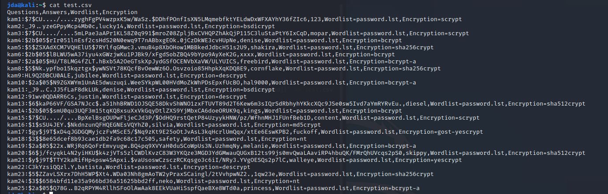

# passEncoding

## Description
This is a simple bash script that will encrypt password from a password list commonly found in a linux machine in the john folder. 
The encrptions included are yescrypt, gost-yestcrpt, scrypt, bcrypt, bcrypt-a, sha512crypt, md5crypt, bsdicrypt, descrypt, nt.

### Installation
Users can download the repo form here on our github, or open up your linux machine open up a terminal and open up your favorite text editor.

## Usage

Here I'll show you how to open it up using vim. You can copy this name or come up with your own name just make sure it ends with .sh
```bash
vim PassEncoding.sh
```
Press **i** to start typing into the vim editor. Copy and paste if you haven't done so from the repo named **PassEncoding.sh**. 

If you need to you can change and custumize the amount of times the programe iterates. The default we have is 25 times. To change the number you can edit out the 25 and insert the number of times you want it to be iterated. 

```bash
for i in {1..25}
``` 

If you wanted to change the password list used you can do so as well, change the following line to the new directory where the password list you would like to use. 
```bash
  pass=$(shuf -n 1 /usr/share/john/password.lst)
 ```
This would be the directory if you wanted to try using a diffrent password list known as the **rockyou**
```bash
  pass=$(shuf -n 1 /usr/share/wordlists/rockyou.txt)
```
Next if you wanted to custumize the format the file outputs just change this line. 

```bash
echo "kam$i:$epass,$pass,Wordlist=password.lst,Encryption=${ARRAY[rand}}" >> test.csv
```
You might have to create users for the school let use **CSUDH** as our user. You can even send it to a diffrent file to be saved SchoolUsers
```bash
echo "CSUDH$i:$epass,$pass,Wordlist=password.lst,Encryption=${ARRAY[rand}}" >> SchoolUsers.csv
```
Now it time to save your bash script. **Press Esc Key** then 
```bash
:w
```
This will save your bash scrpt but not close the vim, incase you want to edit again. 

Now it time to test our Bash Script. **Replace PassEncoding.sh with whatever you named your bash scrpt.**

```bash 
bash PassEncoding.sh
```
Let check out the file we created in the example above we had a file name **test.csv**. To do this enter following example below into the terminal. 
```bash
cat test.csv
```
You should get something that kind of looks like the following picture, keep in mind we used a "Random" so our will look a little diffrent than yours. Plus linux os encrptes hashs diffrently even if we used the same passwords. 



If they look pretty simular congrates you just encrpted 25 passwords, and possibly created your first bash script. 

## Contributing

## License

